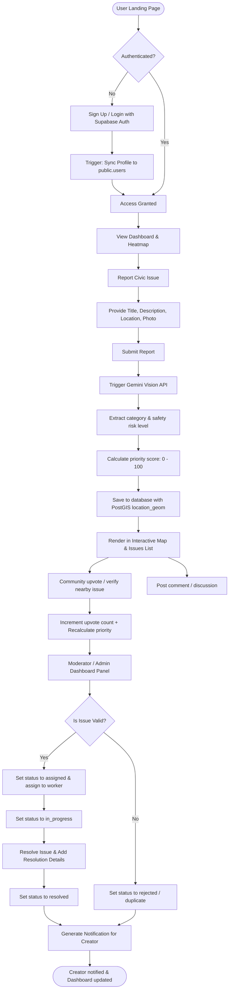

# ResolveAI - Project Documentation

## 📝 Project Description
ResolveAI is a hyperlocal civic priority engine and community intelligence platform designed to bridge the communication gap between citizens and municipal authorities. It enables citizens to report local civic issues (such as potholes, streetlights, and public infrastructure damage) with geolocated photos and descriptions. These reports are analyzed in real time using the Google Gemini Vision API to automatically categorize the issue, assess its severity, and determine public safety risks. A custom priority engine dynamically ranks reports based on verification metrics, upvotes, and AI inputs, ensuring that critical issues are bubbles up to municipal workers for assignment, resolution, and verification.

---

## 🛠️ Tech Stack

| Layer | Technology | Purpose & Description |
| :--- | :--- | :--- |
| **Frontend** | React 18 & Vite | Fast, responsive component framework and HMR bundle builder |
| **Frontend** | React Router | Client-side route and navigation guard management |
| **Frontend** | TailwindCSS | Modern utility-first CSS styling system |
| **Frontend** | Leaflet & React-Leaflet | OpenStreetMap interactive markers and coordinates mapping |
| **Frontend** | Recharts | Visual charts for community metrics and analytics |
| **Frontend** | Axios & React Hook Form | HTTP client request handler and form validator |
| **Backend** | Express.js (Node.js) | Fast, minimalist routing server and endpoints gateway |
| **Backend** | Pino & Pino HTTP | Fast, structured logging for tracing and diagnostics |
| **Backend** | Helmet & CORS | Header security hardening and cross-origin resource sharing |
| **Database** | Supabase (PostgreSQL) | Relational database storage with Row-Level Security (RLS) |
| **Database** | PostGIS Extension | Geospatial indexing and spatial proximity query support |
| **Database** | Supabase Auth | Signups, user credentials, and session token checks |
| **AI Integration** | Google Gemini API | Multimodal Vision model for automatic issue categorization |
| **Hosting** | Vercel | Production hosting for React frontend |
| **Hosting** | Railway | Production hosting for Express API server |

---

## 💾 Database Schema

The database architecture is designed with security and high-performance querying in mind. It uses PostGIS geography markers for geospatial proximity checks.

### Core Tables
1. **`users`**: Extends Supabase's `auth.users` schema. Stored in `public.users` via database triggers, caching user roles (`citizen`, `moderator`, `admin`), name, avatar, and bio.
2. **`issues`**: Stores reported issues, including details, status (`reported`, `verified`, `prioritized`, `assigned`, `in_progress`, `resolved`), AI risk assessment, priority score (0-100), location strings, numeric coordinates, and PostGIS `geography` point data.
3. **`comments`**: Stores discussion messages posted under specific issues.
4. **`issue_votes`**: Prevents duplicate voting by using a unique index on `(issue_id, user_id)` to track upvotes and downvotes.
5. **`activity_logs`**: Audit trail mapping old and new value snapshots of issue updates.
6. **`notifications`**: User alert entries generated when issue statuses are modified.

---

## 📊 Entity-Relationship Diagram (ERD)

Below is the entity-relationship representation of the database tables:

```mermaid
erDiagram
    users {
        uuid id PK "auth.users.id"
        varchar email UNIQUE
        varchar full_name
        text avatar_url
        varchar role "citizen | moderator | admin"
        text bio
        varchar location
        timestamp created_at
        timestamp updated_at
    }
    issues {
        uuid id PK
        varchar title
        text description
        varchar category "pothole | garbage | water_leakage | broken_streetlight | open_manhole | road_damage | public_infrastructure_damage | other"
        varchar status "reported | verified | prioritized | assigned | in_progress | resolved | rejected | duplicate"
        varchar risk_level "low | medium | high | critical"
        integer priority "0 - 100"
        varchar location
        decimal latitude
        decimal longitude
        geography location_geom "PostGIS POINT"
        uuid user_id FK "users.id"
        integer upvotes
        integer downvotes
        integer comments_count
        integer views_count
        text resolution_notes
        timestamp resolved_at
        uuid assigned_to FK "users.id"
        timestamp created_at
        timestamp updated_at
    }
    comments {
        uuid id PK
        uuid issue_id FK "issues.id"
        uuid user_id FK "users.id"
        text content
        integer upvotes
        timestamp created_at
        timestamp updated_at
    }
    issue_votes {
        uuid id PK
        uuid issue_id FK "issues.id"
        uuid user_id FK "users.id"
        varchar vote_type "upvote | downvote"
        timestamp created_at
    }
    activity_logs {
        uuid id PK
        uuid issue_id FK "issues.id"
        uuid user_id FK "users.id"
        varchar action
        jsonb old_value
        jsonb new_value
        timestamp created_at
    }
    notifications {
        uuid id PK
        uuid user_id FK "users.id"
        uuid issue_id FK "issues.id"
        varchar type
        varchar title
        text message
        boolean is_read
        timestamp created_at
    }

    users ||--o{ issues : "reports"
    users ||--o{ comments : "writes"
    users ||--o{ issue_votes : "casts"
    users ||--o{ notifications : "receives"
    issues ||--o{ comments : "has"
    issues ||--o{ issue_votes : "receives"
    issues ||--o{ activity_logs : "tracks"
```

---

## 🔄 System Flow Diagram

The flowchart below traces the lifecycle of an issue report from creation to resolution:



---

## 🔗 Deployment Links
- **Production Web Application:** [https://resolve-ai.vercel.app](https://resolve-ai.vercel.app)
- **Production API Server:** [https://resolve-ai-api.railway.app](https://resolve-ai-api.railway.app)
